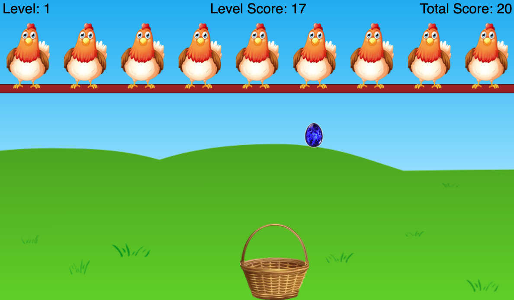

# Chicken Eggs Game
This program is a recreation of one of my favourite games to play as a child - Chicken Eggs. In the traditional game, the objective of the game is to catch as many eggs as you can in the basket. In this version, I introduced new dynamics into the game such a leveling up system, various types of eggs and more.

## The Program:
### How to Play:
* The objective of this version remains the same as the original version - to accumulate as many points as possible by catching as many eggs as you can, however there are some differences:
	* Leveling System:
		* Like many other games, you progress in this game by completing levels to unlock new levels
			* Each new level will contain a new and larger set of eggs (each level with 5 more eggs than the previous) and the eggs will fall down at a faster speed (the speed increase is linear)
	* Point System:
		* There are two types of scores, the "Level Score" and the "Total Score"
			* The Level Score keeps track of how many points you have scored in a specific level - which means it resets to 0 before a new level starts
			* The Total Score keeps track of the total amount of points you have scored through out the game (this does not reset after every level)
	* Not all eggs are equal:
		* There are 4 types of eggs in this game, the standard egg (brown), the silver egg (silver), the sapphire egg (shiny blue) and the bomb. Catching these eggs will contribute to your score in a different way:
			* Standard eggs will increase your score by 1 point
			* Silver eggs will increase your score by 2 points
			* Sapphire eggs will increase your score by 5 points
			* Bombs will either kill you (game over) if your level score is 0 or reset your level score to 0 otherwise
	* Method of Loss:
		* The game is over when your level score is less than 0
		* Failing to catch any egg (not a bomb) will decrease your level score by 1
		* This means you must try to catch as many eggs and avoid as many bombs as you can - as either not catching an egg or catching a bomb will lower your level score
### Pictures of Gameplay:

#### Level 1: Brown Egg Dropping

#### Level 1 : Silver Egg Dropping

#### Level 1: Sapphire Egg Dropping

#### Level 1: Bomb Dropping

#### After a level is completed, a message appears with a live countdown of 3 seconds until the next level:

#### When the game is over, the stats of the game are displayed in the end screen. The user can click to play again:

## Challenges Faced:
As with any other project, when designing and building this game, multiple challenges arisen which required critical thinking and patience. There were 3 main obstacles I came across when creating this game:
1. Flawed Design Approach:
* When I initially started coding this project, I did not spend a lot of time planning it out. I had a very rough idea of what I wanted to accomplish but did not explicitly lay out a plan. This later created massive roadblocks that could have easily been avoided. For example, initially, I did not use an object-oriented approach to create this game. Because I didn't have a clear idea of what I wanted to achieve, I did not realize that the code would get so complex. Not separating the different classes from each other (such as the egg class, basket class, chicken class etc.) created a huge mess in the code base which cost me a lot of time to maintain and develop. Once I transitioned the design approach to an object-oriented model, the code became much cleaner and my thoughts, ideas, and processes became way more organized.
2. Creating a timer:
* When creating the countdown for the next level (as seen in one of the pictures above), I could not use the native JavaScript timer object (with methods such as setTimeout()) because of the interface design I had chosen (it would cause a lot of headaches). This meant I had to figure out a way to display a live countown without using a built in timer object. After some time I figured out a clever way to achieve this. It involved tweaking the frame rate of the main loop (controlled by the method frameHandler()) at specific times to create the effect that there is a timer when in reality, the frame rate was just heavily reduced.
3. Setting up a proper development environment:
* Initially, when I started this project, I was using the index.html file to test and view my code changes. This worked for some time until it came time to insert the images into the game. Since I was unaware of many browser's restrictions on which files can be accessed on a local machine, my images would not load. Furthermore, using the html file on your local machine to test and see your code in action is not a good idea since it does not depict a realistic environment of a machine that would run the code, had I decided to publish this as a website. To solve this, I completely changed my workflow by installing node.js and running a local server on my computer to simulate an environment more realistically. This also removed the restrictions normal browsers had on file access, so that I could use images in my code. I did a lot of research on local server environments so that next time, I know how to develop an application more efficiently.

## Future Improvements:

